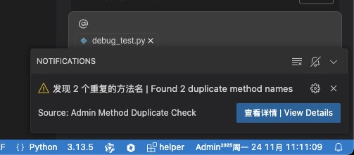
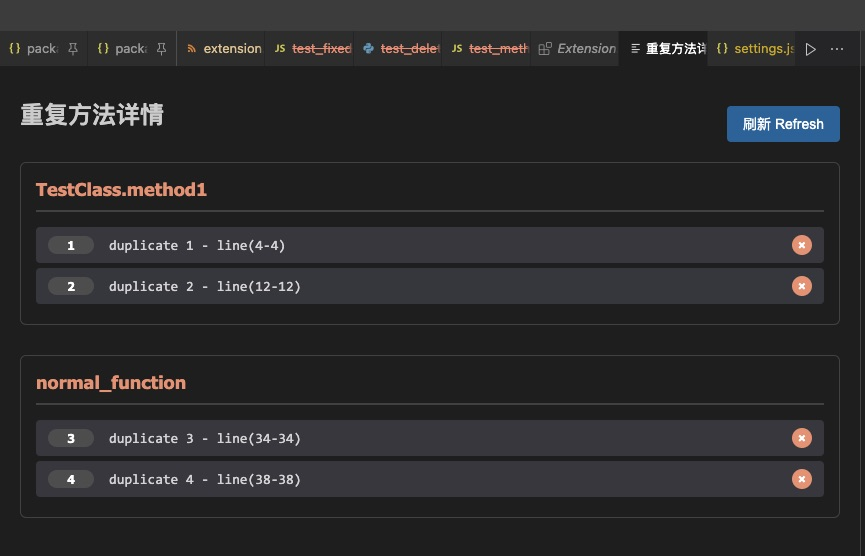

# Admin Method Duplicate Check

一个强大的VSCode扩展，用于检测文件中的重复方法名，支持多种编程语言。

A powerful VSCode extension that detects duplicate method names in files, supporting multiple programming languages.

## 功能特性 | Features

- [x] **多语言支持** | **Multi-language Support** - 支持40+种主流编程语言 | Supports 40+ mainstream programming languages
- [x] **波浪线标记** | **Wavy Line Underline** - 在重复方法名下显示红色波浪线 | Shows red wavy lines under duplicate method names
- [x] **滚动条警告** | **Scroll Bar Warning** - 在右侧滚动条显示警告色块 | Shows warning color blocks in the right scroll bar
- [x] **弹窗通知** | **Popup Notification** - 右下角弹窗提醒重复方法 | Popup notification in bottom right corner
- [x] **高度可配置** | **Highly Configurable** - 支持自定义文件类型、颜色、提醒方式 | Customizable file types, colors, and notification methods
- [x] **实时检测** | **Real-time Detection** - 编辑时自动检测重复方法 | Automatically detects duplicate methods while editing
- [x] **悬停提示** | **Hover Tooltip** - 鼠标悬停显示重复信息 | Shows duplicate information on hover

## 支持的编程语言 | Supported Languages

### 主流语言 | Mainstream Languages
- **Python** (`.py`) - `def method_name(`
- **JavaScript/TypeScript** (`.js`, `.ts`, `.jsx`, `.tsx`) - `function method_name(`
- **Java** (`.java`) - `public void method_name(`
- **C/C++** (`.c`, `.cpp`, `.h`, `.hpp`) - `void method_name(`
- **C#** (`.cs`) - `public void method_name(`
- **PHP** (`.php`) - `function method_name(`
- **Ruby** (`.rb`) - `def method_name`
- **Go** (`.go`) - `func method_name(`
- **Rust** (`.rs`) - `fn method_name(`
- **Swift** (`.swift`) - `func method_name(`
- **Kotlin** (`.kt`) - `fun method_name(`
- **Scala** (`.scala`) - `def method_name(`
- **Dart** (`.dart`) - `void method_name(`

### 其他语言 | Other Languages
- **VB.NET** (`.vb`) - `Function method_name(`
- **Pascal/Delphi** (`.pas`) - `procedure method_name(`
- **Lua** (`.lua`) - `function method_name(`
- **Perl** (`.pl`) - `sub method_name`
- **R** (`.r`, `.R`) - `method_name <- function(`
- **Shell** (`.sh`, `.bash`, `.zsh`, `.fish`) - `method_name()`
- **Assembly** (`.asm`, `.s`) - `method_name:`
- **Nim** (`.nim`) - `proc method_name(`
- **Zig** (`.zig`) - `fn method_name(`
- **V** (`.v`) - `fn method_name(`
- **Crystal** (`.cr`) - `def method_name(`
- **Elm** (`.elm`) - `method_name :`
- **Haskell** (`.hs`) - `method_name ::`
- **OCaml/F#** (`.ml`, `.fs`) - `let method_name`
- **Clojure** (`.clj`) - `(defn method-name`

## 安装 | Installation

### 从VSIX安装 | Install from VSIX
1. 下载最新的 `.vsix` 文件 | Download the latest `.vsix` file
2. 在VSCode中打开命令面板 (Ctrl+Shift+P) | Open Command Palette in VSCode (Ctrl+Shift+P)
3. 输入 "Extensions: Install from VSIX" | Type "Extensions: Install from VSIX"
4. 选择下载的 `.vsix` 文件 | Select the downloaded `.vsix` file
5. 重启VSCode | Restart VSCode

### 从市场安装 | Install from Marketplace
🔗 [VSCode Marketplace](https://marketplace.visualstudio.com/items?itemName=superadmini.admin-method-duplicate-check)

## 📸 截图展示 | Screenshots

### 重复方法检测 | Duplicate Method Detection


### 弹窗通知 | Popup Notification


### 详情窗口 | Details Window


### 删除确认 | Delete Confirmation


## 使用方法 | Usage

安装扩展后，打开支持的编程语言文件：
After installing the extension, open a supported programming language file:

```python
class TestClass:
    def method1(self):  # ✅ 正常 | Normal
        pass
    
    def method2(self):  # ✅ 正常 | Normal
        pass
    
    def method1(self):  # ❌ 重复！波浪线警告 | Duplicate! Wavy line warning
        pass
    
    def method3(self):  # ✅ 正常 | Normal
        pass
    
    def method2(self):  # ❌ 重复！波浪线警告 | Duplicate! Wavy line warning
        pass
```

重复的方法名将会：
Duplicate method names will:
- 显示红色波浪线 | Show red wavy lines
- 在滚动条显示警告色块 | Show warning color blocks in scroll bar
- 右下角弹窗提醒 | Show popup notification

## 配置选项 | Configuration

在VSCode设置中可以配置以下选项：
The following options can be configured in VSCode settings:

### `adminMethodDuplicateCheck.enabled`
- **类型 | Type:** `boolean`
- **默认值 | Default:** `true`
- **描述 | Description:** 启用/禁用方法重复检测 | Enable/disable duplicate method detection

### `adminMethodDuplicateCheck.fileExtensions`
- **类型 | Type:** `array`
- **默认值 | Default:** 所有主流编程语言后缀名 | All mainstream programming language extensions
- **描述 | Description:** 要检测的文件后缀名 | File extensions to check for duplicate methods
- **示例 | Example:** `[".py", ".js", ".ts", ".java"]`

### `adminMethodDuplicateCheck.enableWavyLine`
- **类型 | Type:** `boolean`
- **默认值 | Default:** `true`
- **描述 | Description:** 启用波浪线提示 | Enable wavy line underline for duplicate methods

### `adminMethodDuplicateCheck.enablePopup`
- **类型 | Type:** `boolean`
- **默认值 | Default:** `true`
- **描述 | Description:** 启用右下角弹窗提示 | Enable popup notification in bottom right corner

### `adminMethodDuplicateCheck.wavyLineColor`
- **类型 | Type:** `string`
- **默认值 | Default:** `"#ff0000"` (红色 | Red)
- **描述 | Description:** 波浪线颜色 | Wavy line color for duplicate methods
- **示例 | Examples:** `"#ff0000"`, `"#ff6600"`, `"#9900ff"`

### `adminMethodDuplicateCheck.warningColor`
- **类型 | Type:** `string`
- **默认值 | Default:** `"#ff8800"` (橙色 | Orange)
- **描述 | Description:** 右侧滚动条警告颜色 | Warning color in scroll bar
- **示例 | Examples:** `"#ff8800"`, `"#ff6600"`, `"#cc0000"`

## 示例配置 | Example Configuration

```json
{
  "adminMethodDuplicateCheck.enabled": true,
  "adminMethodDuplicateCheck.fileExtensions": [
    ".py", ".js", ".ts", ".java", ".cpp", ".cs"
  ],
  "adminMethodDuplicateCheck.enableWavyLine": true,
  "adminMethodDuplicateCheck.enablePopup": false,
  "adminMethodDuplicateCheck.wavyLineColor": "#ff0000",
  "adminMethodDuplicateCheck.warningColor": "#ff8800"
}
```

## 工作原理 | How It Works

1. **实时检测** | **Real-time Detection** - 扩展会实时监控当前打开的文件
2. **模式匹配** | **Pattern Matching** - 使用正则表达式匹配各种编程语言的方法定义
3. **重复检测** | **Duplicate Detection** - 统计方法名出现次数，标记重复项
4. **视觉提醒** | **Visual Alerts** - 通过波浪线、滚动条色块、弹窗等方式提醒用户

## 开发 | Development

### 环境要求 | Requirements
- Node.js
- VSCode
- npm

### 安装依赖 | Install Dependencies
```bash
npm install
```

### 测试 | Test
```bash
npm test
```

### 打包 | Package
```bash
vsce package
```

## 更新日志 | Changelog

### v0.0.9 (2025-11-24)
- 🎨 修复扩展图标显示问题 | Fix extension icon display issue
- 📦 添加扩展图标配置 | Add extension icon configuration
- 🔗 更新仓库链接信息 | Update repository link information

### v0.0.8 (2025-11-24)
- ✨ 新增增强详情窗口 | Enhanced details window with interactive features
- ✨ 点击跳转功能 | Click-to-jump functionality for duplicate methods
- ✨ 删除按钮和确认对话框 | Delete buttons with confirmation dialog
- ✨ 整个方法删除 | Delete entire method (including method definition line)
- 🐛 修复方法边界检测问题 | Fix method boundary detection to include method name line
- 📸 添加截图展示 | Add screenshots to README

### v0.0.7 (2025-11-24)
- ✨ 增强删除功能 | Enhanced delete functionality with confirmation dialog
- ✨ 完整方法删除 | Delete entire method from start to end
- 🔧 方法边界检测 | Method boundary detection for accurate deletion

### v0.0.6 (2025-11-24)
- ✨ 详情窗口增强 | Enhanced details window with interactive UI
- ✨ 重复项索引显示 | Show duplicate items with index numbers
- ✨ 行范围显示 | Display line ranges for each duplicate
- ✨ 刷新功能 | Real-time refresh capability
- 🔧 Webview技术 | Webview-based detail panel implementation

### v0.0.5 (2025-11-23)
- 🔧 修复VSIX打包结构问题 | Fix VSIX package structure issues
- 🐛 解决扩展加载失败 | Resolve extension loading failures
- 📦 改进打包流程 | Improve packaging process

### v0.0.4 (2025-11-23)
- 🐛 修复弹窗通知不显示问题 | Fix popup notification not appearing
- 🔧 修复滚动条颜色块不显示 | Fix scroll bar color blocks not displaying
- 🎨 增强装饰器类型 | Enhanced decoration types with gutter and overview ruler
- 📝 添加调试日志 | Add debug logging for troubleshooting

### v0.0.3 (2025-11-23)
- 🐛 修复跨语言误匹配问题 | Fix cross-language false positive detection
- 🔧 改进语言特定检测 | Improve language-specific detection
- 📊 优化性能 | Performance optimization

### v0.0.2 (2025-11-22)
- 🐛 修复Python中f-string误识别问题 | Fix f-string false positive detection in Python
- 🐛 修复波浪线位置计算错误 | Fix wavy line position calculation error
- 🔧 改进正则表达式匹配精度 | Improve regex pattern matching accuracy

### v0.0.1 (2025-11-22)
- ✨ 初始版本发布 | Initial release
- ✨ 支持40+种编程语言 | Support 40+ programming languages
- ✨ 波浪线标记重复方法 | Wavy line marking for duplicate methods
- ✨ 滚动条警告色块 | Scroll bar warning color blocks
- ✨ 右下角弹窗通知 | Bottom right corner popup notifications
- ✨ 高度可配置选项 | Highly configurable options
- ✨ 实时检测和更新 | Real-time detection and updates
- ✨ 悬停提示信息 | Hover tooltip information

## 贡献 | Contributing

欢迎提交Issue和Pull Request！
Welcome to submit Issues and Pull Requests!

1. Fork 这个仓库 | Fork this repository
2. 创建你的特性分支 | Create your feature branch (`git checkout -b feature/AmazingFeature`)
3. 提交你的更改 | Commit your changes (`git commit -m 'Add some AmazingFeature'`)
4. 推送到分支 | Push to the branch (`git push origin feature/AmazingFeature`)
5. 打开一个Pull Request | Open a Pull Request

## 许可证 | License

本项目采用 MIT 许可证 - 查看 [LICENSE](LICENSE) 文件了解详情。
This project is licensed under the MIT License - see the [LICENSE](LICENSE) file for details.

## 链接 | Links

- **VSCode市场 | VSCode Marketplace:** [🔗 admin-method-duplicate-check](https://marketplace.visualstudio.com/items?itemName=superadmini.admin-method-duplicate-check)
- **GitHub仓库 | GitHub Repository:** [🔗 superadmini/admin-method-duplicate-check](https://github.com/superadmini/admin-method-duplicate-check)
- **发布者 | Publisher:** [superadmini](https://marketplace.visualstudio.com/publishers?target=VSCode&publisher=superadmini)

## 🌟 支持这个项目 | Support This Project

如果这个扩展对你有帮助，请考虑：
If this extension helps you, please consider:

⭐ **在GitHub上给个Star** | **Give it a Star on GitHub**  
👉 [GitHub Repository](https://github.com/superadmini/admin-method-duplicate-check) - 点击右上角的⭐ | Click the ⭐ in the top right corner  

⭐ **在VSCode市场给个好评** | **Give it a good rating on VSCode Marketplace**  
👉 [VSCode Marketplace](https://marketplace.visualstudio.com/items?itemName=superadmini.admin-method-duplicate-check) - 安装后给个5星好评 | Give it 5 stars after installation  

🐛 **报告Bug** | **Report Bugs**  
💡 **提出功能建议** | **Suggest Features**  
📝 **贡献代码** | **Contribute Code**  

你的支持是我们持续改进的动力！
Your support motivates us to keep improving!

---

## 📊 项目状态 | Project Status

✅ **已发布 | Published**  
🎯 **版本 | Version:** 0.0.9  
📦 **下载 | Downloads:** 正在统计中... | Counting...  
⭐ **Star | Stars:** [点击这里给Star](https://github.com/superadmini/admin-method-duplicate-check) | [Click here to Star]  
🔍 **检测语言 | Languages:** 40+ 种编程语言 | 40+ programming languages  

---

**Made with ❤️ by [superadmini](https://github.com/superadmini)**